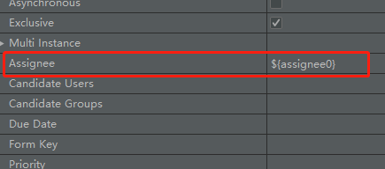

# Activiti Demo

整合 Activiti 启动项目的时候会自动创建生成流程管理一系列的表，所有的表都是以ACT_为前缀，这一系列的表包含以下几类

> 第一类 ACT_RE_* 表中间包含有RE的表里面存储的都是一些静态资源信息 包含 流程定义，流程的资源，图片，规则等
> 
> 第二类 ACT_RU_* 这是运行时的表存储着流程变量，用户任务，变量，职责（job）等运行时的数据。Activiti只存储实例执行期间的运行时数据，当流程实例结束时，将删除这些记录。
> 
> 第三类 ACT_HI_* 这些表包含着流程执行的历史相关数据，如结束的流程实例，变量，任务，等等
>
> 第四类 ACT_GE_* 全局通用数据及设置(general)，各种情况都使用的数据。

#### 部分表
|序号|表名|说明|
|:---:|:---:|:---:|
|1|act_ge_bytearray|二进制数据表|
|2|act_hi_actinst|历史节点表|
|3|act_hi_identitylink|历史流程人员表|
|4|act_hi_detail|历史详情表，提供历史变量的查询|
|5|act_hi_procinst|历史流程实例表|
|6|act_hi_taskinst|历史任务实例表|
|7|act_hi_varinst|历史变量表|
|8|act_re_deployment|部署信息表|
|9|act_re_model|流程设计模型部署表|
|10|act_re_procdef|流程定义数据表|
|11|act_ru_event_subscr|throwEvent、catchEvent时间监听信息表|
|12|act_ru_execution|运行时流程执行实例表|
|13|act_ru_identitylink|运行时流程人员表，主要存储任务节点与参与者的相关信息|
|14|act_ru_job|运行时定时任务数据表|
|15|act_ru_task|运行时任务节点表|
|16|act_ru_variable|运行时流程变量数据表|


|服务名称|描述|
|:---:|:---:|
|RepositoryService*|Activiti 中每一个不同版本的业务流程的定义都需要使用一些定义文件，部署文件和支持数据，Repository Service 提供了对 repository 的存取服务。|
|RuntimeService*|Activiti 中每当一个流程定义被启动一次之后，都会生成一个相应的流程对象实例。Runtime Service 提供了启动流程、查询流程实例、设置获取流程实例变量等功能。此外它还提供了对流程部署，流程定义和流程实例的存取服务。|
|TaskService*|Activiti 中业务流程定义中的每一个执行节点被称为一个 Task，对流程中的数据存取，状态变更等操作均需要在 Task 中完成。Task Service 提供了对用户 Task 和 Form 相关的操作。它提供了运行时任务查询、领取、完成、删除以及变量设置等功能。|
|ManagementService|Management Service 提供了对 Activiti 流程引擎的管理和维护功能，这些功能不在工作流驱动的应用程序中使用，主要用于 Activiti 系统的日常维护。|
|HistoryService|History Service 用于获取正在运行或已经完成的流程实例的信息，与 Runtime Service 中获取的流程信息不同，历史信息包含已经持久化存储的永久信息，并已经被针对查询优化。|

[详细参考文档](https://www.jianshu.com/p/684e11224c9b)

[内网 swagger 访问地址 192.168.0.191:9000/swagger-ui.html](http://192.168.0.191:9000/swagger-ui.html)
 
### 一个流程从 设计→部署→启动 的步骤梳理
>
> 第一步，设计流程图，创建流程文件 .bpmn 文件
> 
> 文件包括了 流程 key，任务流，每个任务节点(task)设置唯一的 key 以及任务办理人(assignee),
> 任务代理人可以直接指定也可以动态指定，如何动态指定，请看下面详解
>
> 第二步，部署流程，根据文件部署流程，可以通过.xml、.bpmn 以及 zip 几个方式部署流程，
>部署的流程将会以二进制的形式存储在数据库表中
>
> 第三步，启动流程，启动流程时使用到Activiti提供的RuntimeService，通过流程图设计时的 key 值进行启动
>
 
 
 遇到的问题：
 
>
> ##### 1.设计流程图的时候流程任务需要指定任务办理人（ASSIGNEE），但是实际应用上是流程启动的时候才会指定办理人，如何在启动流程时动态的设置办理人
>>
>> 解决方案：使用IEL表达式，在启动流程时设置办理人
>>
>> UEL 表达式在bpmn文件里面的写法
>> 
>> 
>>
>> 在设计流程图的时候设定了UEL表达式，然后在流程启动的时候动态的设置对应表达式准确的值
>>
>>
>> ```java
>> public class ProcessController {
>>     public DemoVO startProcessInstance(@PathVariable String key, String username) {
>>         Map<String,Object> map = new HashMap<>();
>>         // key 为UEL表达式的变量名，value为将要为表达式设置的准确的值
>>         map.put("assignee0", username);
>>         /**
>>          * startProcessInstanceByKey(key, map);
>>          * 该函数为根据流程 key 来启动一个流程实例
>>          * 其中第二个值就是启动流程时要被动态设置的变量名和值
>>          * 可以设置多个表达式变量
>>          */
>>         ProcessInstance processInstance = this.runtimeService.startProcessInstanceByKey(key, map);
>>         return DemoVO.success(process);
>>     }
>> }
>> ```
> ##### 2.Activiti7 中去除了 FormService 所以还不清楚流程任务表单如何设计，如何生成动态表单
>> 
>> 从教程视频中得知，Activiti 为了更加专注于自身的业务流程管理，所以删除了FromService，认为表单应该归属于
>> 业务系统自身的业务，但是如何解决该问题，还需后续继续学习。
>> 
> ##### 3.流程正在运行中，更换流程模型，流程是否会发生改变，会发生什么改变
>> 网上查了很多但是没有具体的答案
>> 具体会造成什么样的影响还需要后期demo的实验测试探索才能得知
>> 
